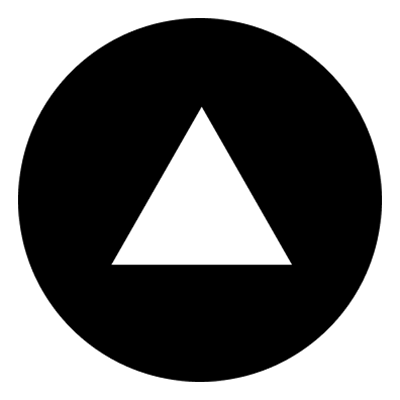

# Landing Page De Apresentação Do IPhone 16 

## Descrição

Esta landing page foi criada para apresentar as características e funcionalidades do iPhone 16 de forma atraente e informativa. O design é otimizado para todos os dispositivos.

## Funcionalidades

- **Design Atraente**: Layout moderno e visualmente agradável.
- **Otimização SEO**: Estrutura amigável para motores de busca.

## Uso

Para visualizar a landing page, siga os passos abaixo:

1. Abra o arquivo `index.html` no seu navegador.
2. Navegue pelas seções para explorar as informações sobre o iPhone 16.
3. Utilize a barra de rolagem para visualizar todo o conteúdo.
4. Clique em links para acessar mais detalhes ou seções específicas.

## Licença MIT

A Licença MIT é uma licença de software permissiva que permite aos usuários:

Usar: Você pode usar o software para qualquer propósito.
Modificar: Sinta-se à vontade para alterar o código conforme necessário.
Distribuir: Compartilhe o software com outros, na sua forma original ou modificada.
Condições
A única exigência é que a atribuição original seja mantida nas cópias do software.

## Visualização do Projeto
Para uma melhor visualização, especialmente em notebooks menores, recomenda-se ajustar o zoom para 50%. Isso ajudará na visualização e no ajuste do conteúdo. Em telas maiores, esse ajuste não será necessário.

## Site hospedado no Vercel e repositorio disponivel no Github

- Clique na imagem para conhecer :)

<h1>Vercel & Github</h1>

